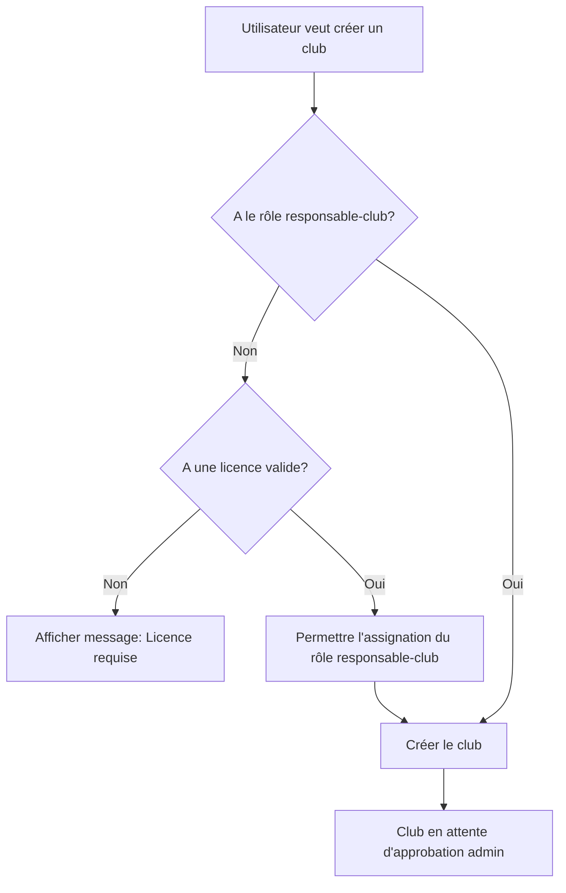

# Système de Permissions et Rôles - SAE301

## Vue d'ensemble

Le système de permissions de SAE301 est basé sur **Spatie Laravel Permission** et gère l'accès aux ressources (clubs, raids, courses) en fonction des rôles des utilisateurs.

## Rôles Disponibles

### 1. Guest (Visiteur)
- **Description**: Utilisateur non connecté
- **Permissions**:
  - Voir les clubs, raids et courses
  - Aucune action de modification ou d'inscription

### 2. User (Utilisateur)
- **Description**: Utilisateur connecté sans licence
- **Permissions**:
  - Voir les clubs, raids et courses
  - Créer un profil
  - Ne peut PAS s'inscrire aux courses (nécessite une licence)

### 3. Adherent (Adhérent)
- **Description**: Utilisateur avec licence valide ou code PPS
- **Conditions**: Licence valide (1 an) OU Code PPS valide (3 mois)
- **Permissions**:
  - Toutes les permissions de User
  - S'inscrire aux courses
  - Base requise pour devenir responsable

### 4. Responsable Club
- **Description**: Adhérent qui gère un ou plusieurs clubs
- **Conditions**: DOIT avoir une licence valide
- **Permissions**:
  - Toutes les permissions d'Adherent
  - Créer des clubs
  - Modifier/supprimer ses propres clubs
  - Gérer les membres de ses clubs

### 5. Gestionnaire Raid
- **Description**: Adhérent qui organise des raids
- **Conditions**: DOIT avoir une licence valide
- **Permissions**:
  - Toutes les permissions d'Adherent
  - Créer des raids
  - Modifier/supprimer ses propres raids

### 6. Responsable Course
- **Description**: Adhérent qui organise des courses
- **Conditions**: DOIT avoir une licence valide
- **Permissions**:
  - Toutes les permissions d'Adherent
  - Créer des courses
  - Modifier/supprimer ses propres courses

### 7. Admin (Administrateur)
- **Description**: Administrateur du système
- **Permissions**: TOUTES les permissions
  - Gérer tous les clubs, raids, courses
  - Approuver/rejeter les clubs
  - Gérer les utilisateurs et leurs rôles
  - Voir les logs d'activité

## Système de Licences

### Licence Numéro
- **Durée**: 1 an à partir de la date d'ajout
- **Effet**: Octroie automatiquement le rôle **Adherent**
- **Stockage**: `licence_number` et `licence_expiry_date` dans la table `users`

### Code PPS
- **Durée**: 3 mois à partir de la date d'ajout
- **Effet**: Permet l'inscription aux courses mais ne donne PAS le rôle Adherent
- **Stockage**: `pps_code` et `pps_expiry_date` dans la table `users`

### Gestion Automatique
- Le middleware `AssignDefaultRole` vérifie et met à jour le rôle Adherent à chaque requête
- Une commande `php artisan licences:cleanup` permet de nettoyer les licences expirées
- Quand une licence expire, le rôle Adherent est retiré SAUF si l'utilisateur a un rôle dépendant (responsable-club, gestionnaire-raid, responsable-course)

## Flux d'Utilisation

### Inscription à une Course

```mermaid
graph TD
    A[Utilisateur clique sur "S'inscrire"] --> B{Est connecté?}
    B -->|Non| C[Redirection vers login]
    B -->|Oui| D{A une licence/PPS valide?}
    D -->|Non| E[Afficher modal Licence/PPS]
    D -->|Oui| F[Inscription réussie]
    E --> G[Utilisateur entre licence/PPS]
    G --> H[Rôle Adherent assigné automatiquement si licence]
    H --> F
```

### Création d'un Club



## Fichiers Importants

### Backend
- **Migration**: `database/migrations/2026_01_07_085306_add_licence_and_pps_to_users_table.php`
- **Seeder**: `database/seeders/RolesAndPermissionsSeeder.php`
- **Service**: `app/Services/LicenceService.php`
- **Middleware**: `app/Http/Middleware/AssignDefaultRole.php`
- **Policies**:
  - `app/Policies/ClubPolicy.php`
  - `app/Policies/RaidPolicy.php`
  - `app/Policies/RacePolicy.php`
- **Controllers**:
  - `app/Http/Controllers/LicenceController.php`
  - `app/Http/Controllers/Race/RaceRegistrationController.php`
- **Command**: `app/Console/Commands/CleanupExpiredLicences.php`

### Frontend
- **Composant**: `resources/js/Components/LicenceModal.jsx`

### Routes
- **Web**: `routes/web.php`
  - `POST /licence` - Ajouter une licence
  - `POST /pps` - Ajouter un code PPS
  - `GET /credentials/check` - Vérifier les credentials
  - `GET /races/{race}/registration/check` - Vérifier l'éligibilité
  - `POST /races/{race}/register` - S'inscrire à une course

## Permissions Détaillées

| Permission | Guest | User | Adherent | Resp. Club | Gest. Raid | Resp. Course | Admin |
|------------|-------|------|----------|------------|------------|--------------|-------|
| view-clubs | ✅ | ✅ | ✅ | ✅ | ✅ | ✅ | ✅ |
| view-raids | ✅ | ✅ | ✅ | ✅ | ✅ | ✅ | ✅ |
| view-races | ✅ | ✅ | ✅ | ✅ | ✅ | ✅ | ✅ |
| register-to-race | ❌ | ❌ | ✅ | ✅ | ✅ | ✅ | ✅ |
| create-club | ❌ | ❌ | ❌ | ✅ | ❌ | ❌ | ✅ |
| edit-own-club | ❌ | ❌ | ❌ | ✅ | ❌ | ❌ | ✅ |
| delete-own-club | ❌ | ❌ | ❌ | ✅ | ❌ | ❌ | ✅ |
| create-raid | ❌ | ❌ | ❌ | ❌ | ✅ | ❌ | ✅ |
| edit-own-raid | ❌ | ❌ | ❌ | ❌ | ✅ | ❌ | ✅ |
| delete-own-raid | ❌ | ❌ | ❌ | ❌ | ✅ | ❌ | ✅ |
| create-race | ❌ | ❌ | ❌ | ❌ | ❌ | ✅ | ✅ |
| edit-own-race | ❌ | ❌ | ❌ | ❌ | ❌ | ✅ | ✅ |
| delete-own-race | ❌ | ❌ | ❌ | ❌ | ❌ | ✅ | ✅ |
| accept-club | ❌ | ❌ | ❌ | ❌ | ❌ | ❌ | ✅ |
| manage-all-* | ❌ | ❌ | ❌ | ❌ | ❌ | ❌ | ✅ |

## Utilisation dans le Code

### Backend - Vérification de Permission

```php
// Dans un contrôleur
if (!auth()->user()->can('create-club')) {
    abort(403, 'Vous n\'avez pas la permission de créer un club');
}

// Avec Policy
$this->authorize('update', $club);

// Vérification de rôle
if (auth()->user()->hasRole('admin')) {
    // Admin logic
}
```

### Backend - Routes Protégées

```php
Route::middleware(['auth', 'role:responsable-club'])->group(function () {
    Route::post('/clubs', [ClubController::class, 'store']);
});

Route::middleware(['auth', 'permission:register-to-race'])->group(function () {
    Route::post('/races/{race}/register', [RaceRegistrationController::class, 'register']);
});
```

### Frontend - Vérification de Permission

```jsx
import { usePage } from '@inertiajs/react';

const { auth } = usePage().props;

// Vérifier un rôle
if (auth.user.roles?.includes('responsable-club')) {
    // Afficher bouton créer club
}

// Vérifier une permission
if (auth.user.permissions?.includes('register-to-race')) {
    // Afficher bouton s'inscrire
}
```

## Commandes Artisan Utiles

```bash
# Nettoyer les licences expirées
php artisan licences:cleanup

# Réinitialiser les rôles et permissions
php artisan db:seed --class=RolesAndPermissionsSeeder

# Lister tous les rôles et permissions
php artisan permission:show

# Créer un utilisateur admin
php artisan tinker
>>> $user = User::find(1);
>>> $user->assignRole('admin');
```

## Notes Importantes

1. **Hiérarchie des Rôles**: Les rôles responsable-club, gestionnaire-raid, et responsable-course HÉRITENT automatiquement du rôle adherent via les permissions.

2. **Expiration des Licences**: Le système vérifie automatiquement l'expiration à chaque requête. Pour une performance optimale, programmez la commande `licences:cleanup` dans le scheduler.

3. **Sécurité**: Les permissions sont vérifiées côté backend ET frontend, mais la sécurité réelle est toujours côté backend via les policies et middleware.

4. **Guest Role**: Les visiteurs non connectés n'ont PAS de rôle assigné dans la base de données. Les permissions guest sont gérées par les policies qui acceptent `?User $user`.

5. **Assignment de Rôle**: Pour assigner un rôle qui nécessite une licence, utilisez `LicenceService::assignRoleWithCheck()` qui vérifie automatiquement les prérequis.
